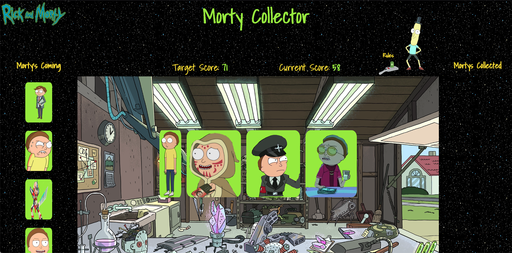

## Morty Collector

## Screenshots / Gifs

## Motivation
A simple homework assignment revisted and updated to a themed collecting game.

## How to
To play visit *Website Link* and click one of the Morty's to reveal his value. Match your score to the target score and collect the Morty you made the winning match with! Collect all 6 Morty's to win the game.

## Tech/framework used
<b> Built with </b>
- [Javascript](https://www.javascript.com/)
- [Jquery](https://jquery.com/)
## Features
N/A

## Credits
Andrew Griswold

## License
This project is covered by the MIT license.
MIT © Andrew Griswold
