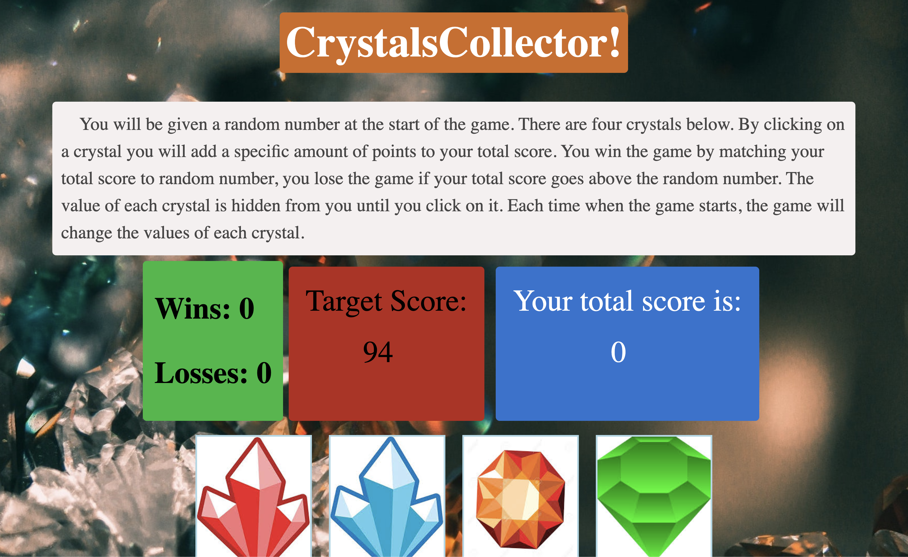

## Jewel Collector

## Screenshots / Gifs

## Motivation
Jewel Collector was a homework assignment to practice Jquery.

## How to
To play Jewel Collector simpling go to https://ThaGrza.github.io/JewelCollector and click on any jewel to begin. Click and see the different values of each jewel and try to match the target score.

## Tech/framework used
<b> Built with </b>
- [Javascript](https://www.javascript.com/)
- [Jquery](https://jquery.com/)
## Features
N/A

## Credits
Andrew Griswold

## License
This project is covered by the MIT license.
MIT © Andrew Griswold
